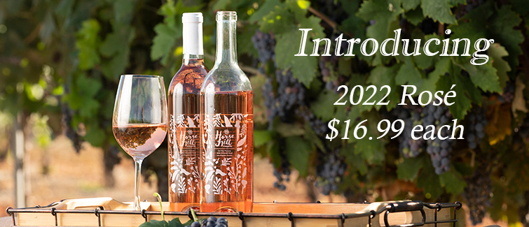
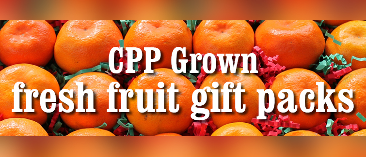

# **Farm Store**

CPP Farm store has a selected assortment of cool fruits and vegetables right from its on-campus farm.

## **Featured Products:**

Illustration of Multiple columns on a website

{#fig-orange}

Great gift for your loved ones. These fruits were raised by students in agriculture majors on CPP campus, processed and packed by student employees at Farm Store.

{#fig-rose}

Fantastic wine produced right here CPP campus by students!

:::: columns
::: {.column width="48%"}

Great gift for your loved ones. These fruits were raised by students in agriculture majors on CPP campus, processed and packed by student employees at Farm Store.
:::
::::

:::: columns
::: {.column width="48%"}

Fantastic wine produced right here CPP campus by students!
:::
::::

## **Web site menu**

Use `panel-tabset` to add multiple tabs to your website.

::: panel-tabset
## Fruit gifts

## Rose wine

:::

For a beautiful graphic of the orange gift set, see @Fig-orange

## Data Analysis

First, we need to:

1.  load packages

2.  import data

3.  check data

### Choosing data

Penguins are very cute !

... so lets
